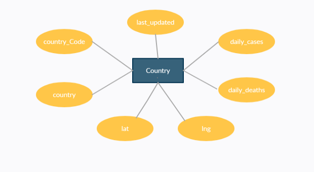

# Modelo para Apresentação do Lab01 - API Acesso

Estrutura de pastas:

~~~
├── README.md  <- arquivo apresentando a tarefa
│
├── images     <- arquivo de imagem da tarefa
│
└── notebook   <- arquivos do notebook
~~~

# Aluno
* `178258`: `Leandro Garcia Pereira`

## Tarefa 1 sobre APIs de acesso

> [lab01 notebook](https://github.com/LeandroGarciaP/MC536/blob/main/lab01/notebook/lab01_api.ipynb)

## Tarefa 2 sobre Engenharia Reversa
>
>
> 
