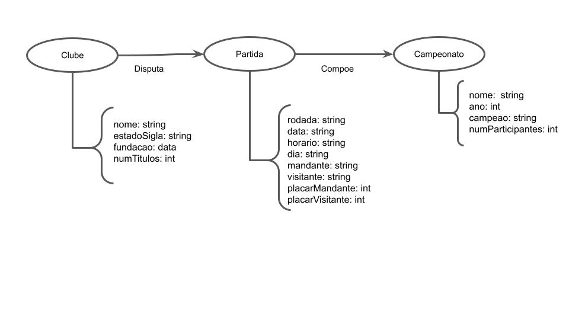
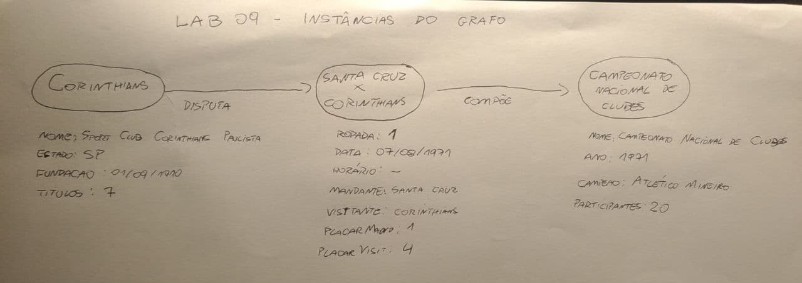

# Modelo para Apresentação do Lab09 - Grafo de Conhecimento

Estrutura de pastas:

~~~
├── README.md  <- arquivo apresentando a tarefa
│
└── images     <- arquivos de imagem usados na tarefa
~~~

# Aluno
* `178258`: `<Leandro Garcia Pereira>`

## Exemplo de Grafo de Conhecimento - para publicar ou enriquecer
> Utilize a abordagem (recurso, propriedade, valor) para apresentar seu grafo exemplo.
> Coloque a imagem do PNG do seu modelo lógico como ilustrado abaixo (a imagem estará na pasta `image).
>
> Grafo ilustrando as classes:
> 
>
> Exemplo de instâncias:
> 

## Perguntas de Pesquisa ou Queries

> Liste aqui as três perguntas de pesquisa ou queries
> * Quais foram os jogos das equipes do estado de SP no Campeonato Nacional de Clubes 1971?
> * Qual foi a equipe vencedora da Copa Brasil em 1984?
> * Quais foram todos os resultados das partidas Corinthians no Campeonato Brasileiro unificado? (1959 - 2021)
